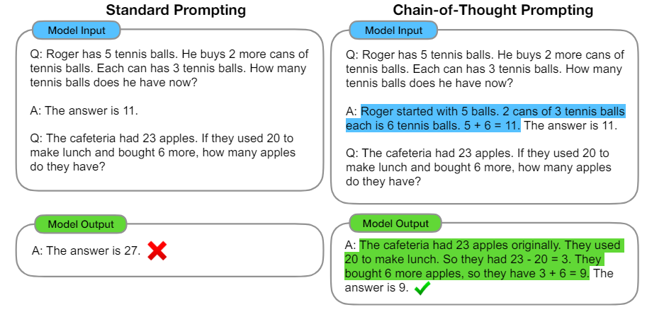

## 개요
COT는 복잡한 문제를 해결하거나 다단계 추론이 필요한 작업을 수행할 때, 인간의 사고 과정을 모방하여 단계별로 사고 과정을 표현하는 기법입니다. COT의 주요 아이디어는 다음과 같습니다:

1. **단계별 추론**: 복잡한 문제를 단계별로 나누어 각 단계를 순차적으로 해결합니다. 각 단계에서는 이전 단계의 결과를 바탕으로 다음 단계의 작업을 수행합니다.
2. **명시적 사고 과정**: 모델이 응답을 생성할 때, 중간 추론 과정을 명시적으로 표현하여 사용자에게 보여줍니다. 이를 통해 모델의 추론 과정이 투명하게 드러나고, 오류를 쉽게 검출할 수 있습니다.

COT는 주로 수학 문제 해결, 논리 퍼즐, 다단계 계획 수립 등 복잡한 추론이 필요한 작업에 유용합니다. 이를 통해 모델이 더 정교하고 신뢰성 있는 응답을 생성할 수 있습니다.

## 논문 요약
2022년 Google Brain 팀은 "Chain of Thought Prompting Elicits Reasoning in Large Language Models" 논문에서 대형 언어 모델이 단순한 지시나 질문에 응답할 때보다, 일련의 추론 과정을 명시적으로 거치는 방식으로 응답할 때 더 나은 성능을 보일 수 있음을 보였습니다. 이를 위해, 연구자들은 모델에게 문제 해결 과정을 단계별로 설명하도록 지시하는 "Chain-of-Thought" 프롬프트를 제시했습니다. 그 결과, CoT 방식은 특히 복잡한 문제나 다단계 추론이 필요한 문제에서 모델의 성능을 크게 향상시켰습니다.

### 주요 내용
1. **Chain-of-Thought 프롬프트**: 모델에게 문제를 해결하기 위한 단계별 사고 과정을 명시적으로 지시하여 응답의 논리성과 정확성을 높임.
2. **실험 결과**: 다양한 문제 영역에서 CoT 방식이 기존의 단순 응답 방식보다 월등히 높은 성능을 보임.
3. **적용 가능성**: 수학 문제, 논리 퍼즐, 복잡한 질문 등 다양한 분야에 적용 가능함을 입증.

### 예시
아래 그림에서 중간 과정 없이 바로 질문을 한 경우 오답을 보여주는데, CoT를 enable 시킨 이후에는 정상적으로 추론을 하는 것을 볼 수 있습니다. 


이를 바탕으로 prompting 할 때 기본 질문을 CoT 형태로 만들어 주는 것이 유리하다고 보는 것입니다. 

- 기본 문제: 어느 상자에 사과가 15개 있습니다. 그 중 7개를 먹고 나면, 상자에는 사과가 몇 개 남아 있을까요?
- 변형된 CoT 프롬프트:
   - 총 사과의 개수를 확인합니다.
   - 먹은 사과의 개수를 확인합니다.
   - 남은 사과의 개수를 계산합니다.

## CoT 유효성 평가 방식

Chain of Thought (CoT) 논문의 평가 부분을 아주 심플하게 정리해 보았습니다. 

### 평가 방법

논문에서는 다음과 같은 다양한 문제 유형에 대해 CoT 프롬프트와 기존의 단순 프롬프트의 성능을 비교 평가했습니다. 
1. **수학 문제**
2. **논리 퍼즐**
3. **복합 추론 문제**

각 문제 유형에서 모델의 성능을 평가하기 위해 다음과 같은 지표를 사용하였습니다.
- **정확도(Accuracy)**: 모델이 문제를 올바르게 해결한 비율.
- **추론의 일관성(Logical Consistency)**: 모델이 단계별 추론 과정에서 논리적으로 일관된 답변을 도출하는 능력.

### 각 유형별 CoT 예시

#### 수학 문제 평가

문제: **5개의 사과 중에서 2개를 먹으면 몇 개가 남아 있을까요?**

- **단순 프롬프트(Simple Prompt)**: 
  ```python
  question = "5개의 사과 중에서 2개를 먹으면 몇 개가 남아 있을까요?"
  ```

- **CoT 프롬프트**:
  ```python
  cot_prompt = (
      f"질문: {question}\n\n"
      "답변을 단계별로 설명해주세요:\n"
      "1. 총 사과의 개수를 확인합니다.\n"
      "2. 먹은 사과의 개수를 확인합니다.\n"
      "3. 남은 사과의 개수를 계산합니다.\n\n"
      "답변:"
  )
  ```

### 논리 퍼즐 평가

문제: **만약 모든 스패너가 도구라면, 모든 도구가 스패너인가요?**

- **단순 프롬프트(Simple Prompt)**: 
  ```python
  question = "만약 모든 스패너가 도구라면, 모든 도구가 스패너인가요?"
  ```

- **CoT 프롬프트**:
  ```python
  cot_prompt = (
      f"질문: {question}\n\n"
      "답변을 단계별로 설명해주세요:\n"
      "1. 스패너와 도구의 정의를 확인합니다.\n"
      "2. 모든 스패너가 도구임을 검증합니다.\n"
      "3. 모든 도구가 스패너인지 검증합니다.\n\n"
      "답변:"
  )
  ```

#### 복합 추론 문제 평가

문제: **기후 변화가 경제에 미치는 영향을 설명해 주세요.**

- **단순 프롬프트(Simple Prompt)**:
  ```python
  question = "기후 변화가 경제에 미치는 영향을 설명해 주세요."
  ```

- **CoT 프롬프트**:
  ```python
  cot_prompt = (
      f"질문: {question}\n\n"
      "답변을 단계별로 설명해주세요:\n"
      "1. 기후 변화의 주요 원인과 현황을 설명합니다.\n"
      "2. 기후 변화가 경제에 미치는 직접적인 영향을 분석합니다.\n"
      "3. 기후 변화로 인한 간접적인 경제적 영향을 설명합니다.\n"
      "4. 전체적인 분석을 종합합니다.\n\n"
      "답변:"
  )
  ```

## 의의
CoT를 통해 우리는 모델의 추론 과정을 좀 더 투명하게 드러낼 수 있기에 결과의 해석 가능성을 높일 수 있습니다. 이는 곳 블랙박스 형태의 llm 추론 과정에 대해 조금이나마 응답의 도출 과정을 이해하기가 용이해 질 수 있다고 할 수 있습니다. 그러나 여전히 CoT 프롬프트의 성능이 특정 유형의 문제에 따라 달라질 수 있다는 것과, 모델의 크기와 훈련 데이터의 다양성이 CoT 프롬프트의 효과에 미치는 영향에 대한 추가 연구는 필요해 보입니다.

## 참조
- Wei, J., Wang, X., Schuurmans, D., Bosma, M., Chi, E., Le, Q., & Zhou, D. "Chain of thought prompting elicits reasoning in large language models." arXiv preprint arXiv:2201.11903, 2022. [URL](https://arxiv.org/abs/2201.11903)
